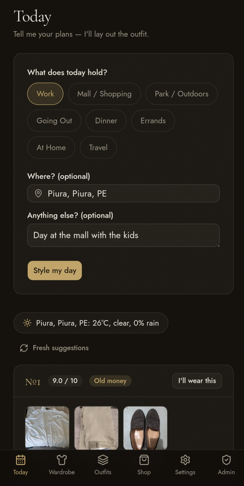
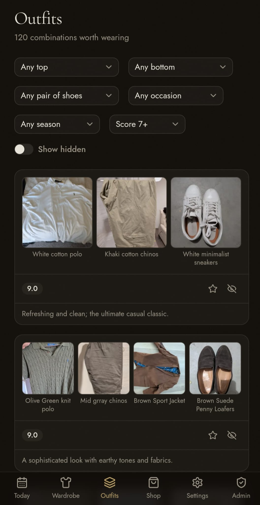
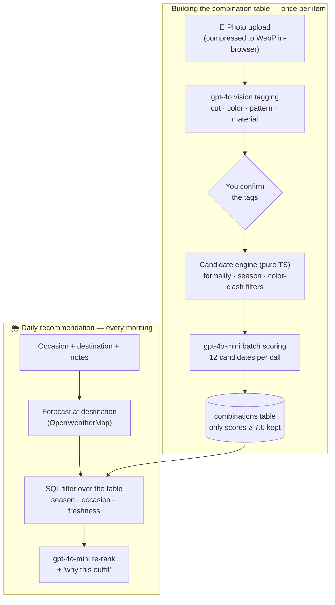
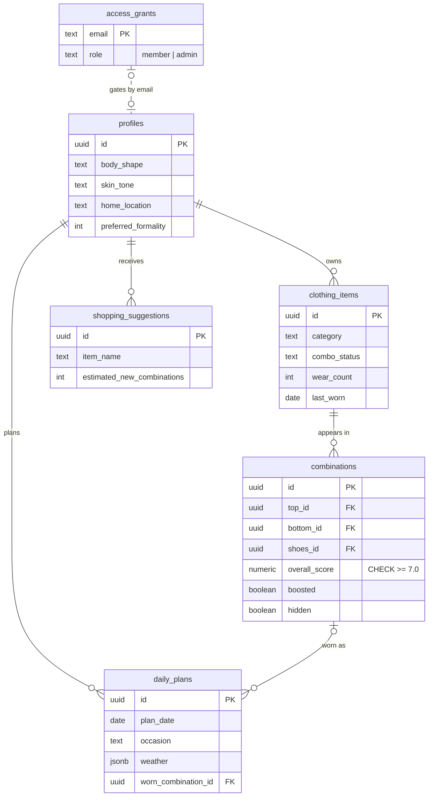

# 🧵 Aether Wardrobe

**Your personal AI stylist.** Photograph your wardrobe once, tell it your plans
each morning, and it lays out the outfit — matched to your style, the occasion,
and the weather at your destination.


> Created by [**Alexis Roldan**](https://github.com/roldanalex) · 2026

---

## 📷 Screenshots

### 🖥️ Desktop


### 📱 Mobile

The app is fully responsive — catalog your wardrobe and get your daily outfit
straight from your phone.

<p>
  
  
</p>

## ✨ What it does

| Feature | How it works |
| --- | --- |
| 🪞 **Onboarding wizard** | A four-step profile — body shape and measurements, skin/hair/eye coloring, style preferences, home city — personalizes every AI prompt and powers the weather fallback when you don't name a destination. |
| 📸 **Wardrobe cataloguing** | Upload one photo per piece — from your gallery or straight from the **phone camera**. Photos are compressed to WebP (≤ 0.3 MB) in the browser before upload, then GPT-4o vision reads the cut, color, pattern and material — and your own notes ("pique", "merino") always win over what it sees. Items group into collapsible **category sections**, with granular types down to footwear (loafers, drivers, sneakers…). |
| 🧩 **Combination table** | A deterministic engine pairs each confirmed piece against your whole wardrobe (formality, season and color-clash filters), then gpt-4o-mini scores candidates in batches. Only outfits scoring ≥ 7.0 are kept. **Build around a piece** by filtering the table to a single item, plus occasion, season or score. |
| 🌦️ **Daily recommendations** | Pick the occasion (work, mall, park, dinner…), optionally a destination and notes. **City autocomplete** resolves the exact location — or your home base fills in — the app pulls the forecast there, filters the table, and one AI call ranks the top picks with a "why this outfit" explanation, each look labeled with its actual item names. |
| 👕 **Wear tracking** | Mark an outfit as worn and every piece in it updates its wear count and last-worn date. Recently worn looks show as "resting" for a week, so recommendations stay fresh. |
| 🗂️ **Outfits browser** | Filter by occasion, season or score. Boost favorites, hide misses, see which looks are resting. |
| 🛍️ **Shopping gap analysis** | Tick the categories you're shopping for. The app counts how many new outfits one good piece would unlock — against your actual wardrobe — and suggests specific items to buy. |
| ⚡ **Live status & readiness** | An app-wide banner tracks outfit generation in the background and tells you when your wardrobe is ready. If a batch is interrupted, a one-click rebuild fills in only the missing combinations. Every route has its own loading state for snappy navigation. |
| 🔑 **Admin allowlist** | An in-app `/admin` page grants or revokes access by email — no dashboard trips required. |

## 💡 Engineering highlights

- **The combination table is the single source of truth.** The AI never
  invents outfits at recommendation time — a pure-TypeScript candidate engine
  (`src/lib/combinations/candidates.ts`) generates and filters pairings, the
  LLM only scores, ranks and explains what that engine already vetted. Results
  stay consistent and costs stay flat.
- **Batch scoring for cost control.** Candidates are scored 12 per
  gpt-4o-mini call and only outfits ≥ 7.0 are stored — enforced by a database
  `CHECK` constraint, not just app code. Estimated cost: **~$0.01–0.03 per
  uploaded item**, fractions of a cent per daily request.
- **No paid call without approval.** Every API route verifies the caller
  against the `access_grants` allowlist *before* touching OpenAI or
  OpenWeatherMap.
- **Defense in depth.** Row-level security on every table, a private storage
  bucket with short-lived signed URLs, and `server-only` imports that make it
  a build error for API keys to reach the browser.
- **Next.js 16 idioms.** App Router route groups, per-route `loading.tsx`,
  session refresh in the renamed `src/proxy.ts` middleware, and structured AI
  output via the Vercel AI SDK's `generateObject` with Zod schemas.

## 🏛️ Architecture



### Data model

Six tables, all behind Supabase row-level security:



### 📁 Project structure

```text
src/
├── app/
│   ├── page.tsx            # Marketing landing with React Three Fiber hero
│   ├── onboarding/         # 4-step profile wizard
│   ├── auth/callback/      # OAuth PKCE code exchange
│   ├── (app)/              # Auth-gated: today, wardrobe, combinations, shop, settings, admin
│   └── api/                # 7 routes — every one checks the allowlist before spending
├── components/             # shadcn/ui primitives + feature components
├── lib/
│   ├── ai/                 # 4 AI call sites (tagging, scoring, re-ranking, shopping) + prompt/retry helpers
│   ├── combinations/       # Deterministic candidate engine, generation, readiness
│   ├── supabase/           # Browser / server / middleware clients
│   └── …                   # weather, geocoding, image compression, access control, gap analysis
├── proxy.ts                # Next 16 middleware: Supabase session refresh
└── stores/                 # Zustand (onboarding draft)
supabase/migrations/        # 7 SQL migrations — schema, RLS, storage policies, access control
```

## 🛠️ Tech stack

Next.js 16 (App Router) · React 19 · TypeScript · Tailwind CSS v4 + shadcn/ui ·
Supabase (Postgres, Google sign-in via `@supabase/ssr`, Storage) ·
Vercel AI SDK (`generateObject` + Zod) with GPT-4o vision and gpt-4o-mini ·
OpenWeatherMap · React Three Fiber · TanStack Query · Zustand

## 🚀 Getting started

### 🔑 Prerequisites

- **Node.js 20+** and **pnpm**
- Free-tier accounts for four services:

| Service | Used for | Where |
| --- | --- | --- |
| 🗄️ Supabase | Database, Google sign-in, image storage | [supabase.com](https://supabase.com) |
| 🔐 Google Cloud | OAuth credentials for sign-in | [console.cloud.google.com](https://console.cloud.google.com/apis/credentials) |
| 🤖 OpenAI | Vision tagging and outfit scoring | [platform.openai.com](https://platform.openai.com) |
| 🌤️ OpenWeatherMap | Destination weather and city autocomplete | [openweathermap.org/api](https://openweathermap.org/api) |

### 1️⃣ Set up Supabase

1. Create a project, then run every file in `supabase/migrations/` **in order**
   in the SQL Editor (or `supabase link && supabase db push` with the CLI).
2. The private `wardrobe` storage bucket is created by migration `0006`.
3. **Grant yourself access** — the app is invitation-only, so bootstrap the
   first admin (yourself) in the SQL Editor:

   ```sql
   insert into public.access_grants (email, role)
   values ('you@example.com', 'admin');
   ```

   Without this step every sign-in — including yours — lands on the
   "awaiting invitation" screen.

### 2️⃣ Enable Google sign-in

1. In Google Cloud Console, create an **OAuth client ID** (Web application).
2. Set the authorized redirect URI to
   `https://<your-project>.supabase.co/auth/v1/callback`.
3. Paste the client ID and secret into **Supabase → Auth → Providers → Google**.

### 3️⃣ Configure and run

```bash
cp .env.example .env.local   # fill in your keys
pnpm install
pnpm dev
```

| Variable | Exposed to browser? | Used for |
| --- | --- | --- |
| `NEXT_PUBLIC_SUPABASE_URL` | Yes (safe by design) | Supabase client |
| `NEXT_PUBLIC_SUPABASE_ANON_KEY` | Yes (safe by design — RLS enforces access) | Supabase client |
| `OPENAI_API_KEY` | **Server-only** | Vision tagging, scoring, re-ranking, shopping suggestions |
| `OPENWEATHER_API_KEY` | **Server-only** | Forecasts and city autocomplete |

> 💸 **Tip:** set a monthly budget cap on your OpenAI key. The app is designed
> to stay cheap, but a cap costs nothing and removes all surprise.

### 4️⃣ Deploy to Vercel

1. Push to GitHub and import the repo at [vercel.com/new](https://vercel.com/new).
2. Add the four environment variables from `.env.example`.
3. In **Supabase → Auth → URL Configuration**, set the Site URL to your Vercel
   domain and add `https://<your-domain>/auth/callback` to the redirect list.

> ⏱️ **Note:** the outfit-generation routes declare `maxDuration = 300`
> seconds. Vercel's Hobby tier caps function duration lower by default, so
> large wardrobes may need a Pro plan (or the built-in rebuild button to
> resume an interrupted batch).

## 🔒 Security & privacy

- 🚫 **No secrets in this repo.** All credentials live in environment
  variables; `.env*` files are git-ignored (only the placeholder
  `.env.example` is tracked).
- 🎟️ **Invitation-only usage.** Anyone can sign in with Google, but only
  emails on the `access_grants` allowlist can use the app — every AI endpoint
  verifies approval **server-side** before spending API credits. Admins grant
  or revoke access from the in-app `/admin` page or the Supabase dashboard.
- 🛡️ Every database table enforces Supabase **row-level security** — users can
  only ever read or write their own rows.
- 🖼️ Wardrobe photos live in a **private** storage bucket, served through
  short-lived signed URLs. Storage policies scope every operation to the
  owner's folder.
- 🔑 Weather and OpenAI calls run **server-side only**; API keys never reach
  the browser (`server-only` imports make the build fail otherwise).

## 🧭 Status & roadmap

This is a personal project, built solo and used daily. Honest notes on what's
not here (yet):

- **No automated tests or CI** — the codebase is strict-TypeScript and
  Zod-validated end to end, but test coverage is the next milestone.
- **Single-photo items** — one photo per piece today; multi-angle photos are
  a candidate feature.
- **Ideas on the list:** laundry/availability tracking, packing lists for
  trips, seasonal wardrobe rotation reminders.

## 📜 License

Released under the [MIT License](LICENSE) — © 2026
[**Alexis Roldan**](https://github.com/roldanalex).
